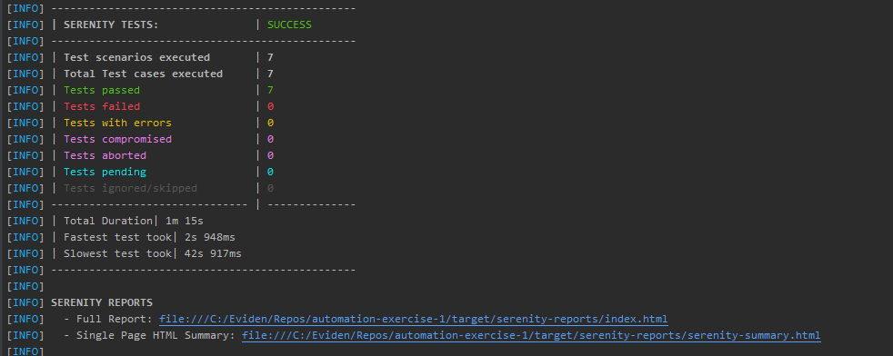

# Web form - UI Tests

This setup is optimized for Cucumber + Serenity + Selenium for end-to-end browser-based automation.

Language & Build used in the framework:

````
Java Version: 11.0.26
Build Tool: Maven (apache-maven-3.8.8)
Encoding: UTF-8
````
Testing Frameworks
````
Serenity BDD: 3.9.8
    serenity-core
    serenity-junit
    serenity-cucumber
Cucumber: 7.14.0
    cucumber-java
    cucumber-junit
````

Browser Automation
````
Selenium WebDriver: 4.9.1 (Fully compatible with Serenity 3.9.8)
````

Maven Plugins
````
Maven Compiler Plugin
Failsafe Plugin (Runs integration tests - supports test naming patterns like *Test.java, When*.java, etc.)
Serenity Maven Plugin (Used for generating aggregated test reports after integration test phase)
````

Other Dependencies
````
Logback (classic) for logging: 1.2.11
````

## Prerequisites
Ensure Java (11.0.26) and Maven (apache-maven-3.8.8) are installed, and corresponding environment variables point to their correct installation directories. 
You can check versions by typing the following commands into cmd:
````
java -version
mvn -v
````

## Test Execution
Ensure the TestRunner.java file includes the correct tags for execution, and that all relevant scenarios are properly tagged.
To execute tests use the following command from the terminal:

````
mvn clean verify 
````

## Reporting
Serenity is configured to generate single-page HTML reports after the test run is completed. These reports provide a clean summary of test results and are automatically generated at the end of execution.



On selecting Full Report,


## Notes
1. Negative test cases are not included, as the form currently accepts all types of submissions without validation
2. Due to time limitations, the following were not included:
   1. Selection of the second radio button 
   2. Cross-browser testing
